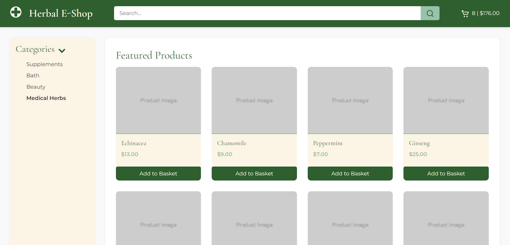
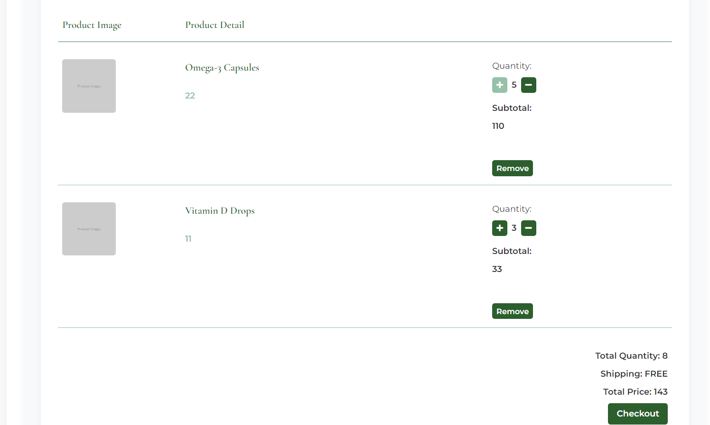
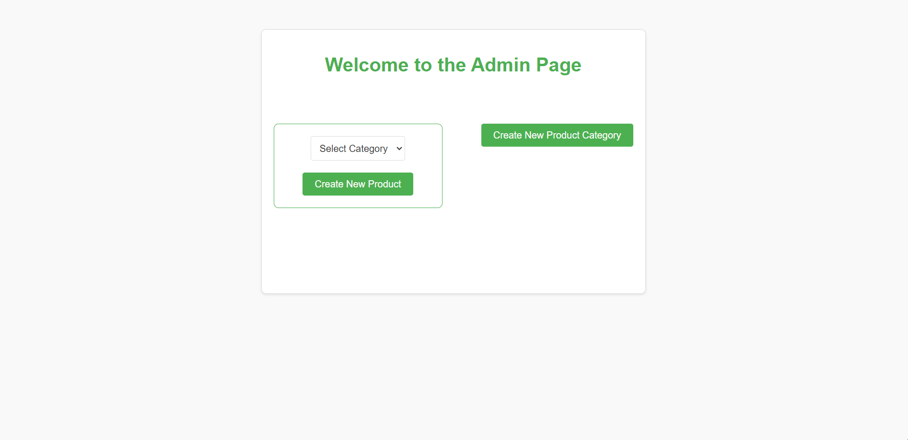

# Herbal E-commerce with Angular and Spring Boot.

Full-stack e-commerce platform with Angular frontend, Spring Boot backend and MySQL database support. 
Platform consist of product selection, categories, search, cart, checkout and role-based access control for administrative tasks.

The main view of the platform consists of four components: a search bar, cart status, a left navigation menu, and a product grid. 
The product grid supports pagination and contains responsive product cards that move, change color, and add shadow when hovered over. 
The search bar allows users to search for products by keywords, while the left navigation menu helps in selecting products by the category to which they belong. 
Products can be added to the cart, and the cart status icon on the top left of the screen will reflect the quantity and price of the products in the cart.

When a user clicks on a product card in the grid, Angular will route them to a detailed product view.
This component offers a more detailed overview of the product and includes additional information such as the product description.
Users can add the product to their cart from this component. If they wish to go back, they can click on the link at the bottom of the page, which will take them back to the exact product grid page.

Clicking the cart status icon will route user to the detailed view of the cart. 
Here, the user can inspect, increase, decrease, or remove items from the cart before proceeding to the checkout page.

The platform includes an admin interface for editing the product database. 
It is secured behind authentication and authorization implemented with the Spring Security API. 
Users with passwords and administrative privileges can use this interface to add, edit, and remove products and product categories from the database without any need to directly interact with the databases.
